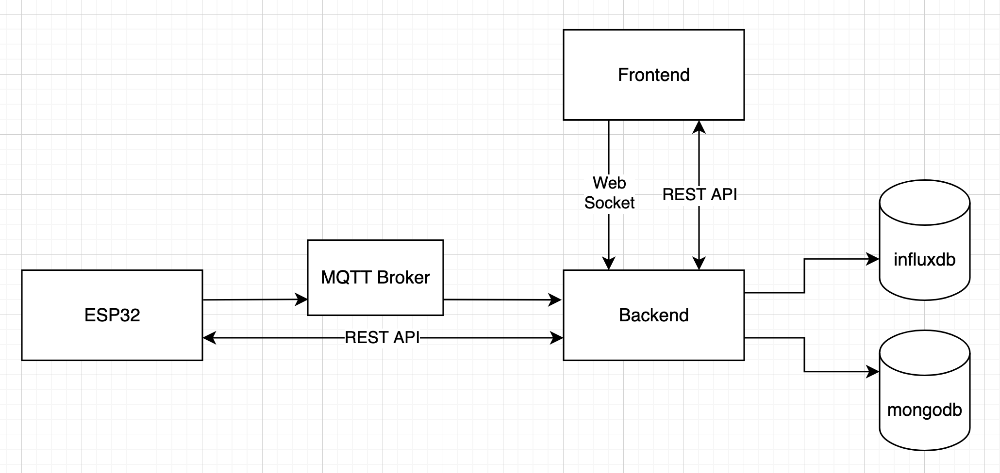

# Embedded Lab Project

Backend service for an embedded systems lab project.

The project combines:

- A Go API built with Fiber
- MongoDB for user records
- Mosquitto as the MQTT broker
- InfluxDB for temperature time-series storage
- Docker Compose for local and containerized runs

## Overview

This service has two main responsibilities:

- Manage user data associated with RFID-based access or balance flows
- Subscribe to MQTT temperature data from ESP32 devices and store it in InfluxDB

The API stores user information in MongoDB. Separately, the application subscribes to the MQTT topic `esp32/temperature`, parses incoming payloads as `float64`, and writes the result to InfluxDB as a `temperature` measurement.

## Architecture

High-level flow:

1. ESP32 publishes a temperature value to Mosquitto on topic `esp32/temperature`
2. The Go application subscribes to that topic
3. The payload is parsed as a float
4. The temperature value is written into InfluxDB
5. User-related API operations read and write MongoDB

Main services in this repository:

- API server
- MongoDB
- mongo-express
- Mosquitto
- InfluxDB

## API Endpoints

Current user endpoints:

- `GET /users/`
- `POST /users/`
- `DELETE /users/:rfid`
- `GET /users/:rfid/amount`
- `PATCH /users/:rfid/amount`

Bruno collection files for these requests are available in [`collections/embedded-lab-project`](./collections/embedded-lab-project).

Current transaction endpoints:

- `GET /transactions/types`
- `GET /transactions/`
- `POST /transactions/`
- `POST /transactions/status`
- `GET /transactions/user-rfid-hashed/:userRFIDHashed`

Current notification endpoints:

- `POST /notifications/discord`

## Tech Stack

- Go `1.25.6`
- Fiber v3
- MongoDB
- InfluxDB 2
- Eclipse Mosquitto
- Docker Compose

## Running the Project

Setup and run instructions are in [docs/set-up.md](./docs/set-up.md).

That guide includes:

- Prerequisites
- Development startup
- Production-style Docker startup
- Required environment variables
- MQTT and InfluxDB verification steps

## Repository Structure

- [`cmd/`](./cmd) application entrypoint
- [`app/`](./app) core application code
- [`docs/`](./docs) project documentation
- [`collections/`](./collections) Bruno API collection
- [`docker-compose.yml`](./docker-compose.yml) base local infrastructure
- [`docker-compose.dev.yml`](./docker-compose.dev.yml) development infrastructure
- [`docker-compose.prod.yml`](./docker-compose.prod.yml) production-style stack

## Notes

- MQTT payloads on `esp32/temperature` must be numeric values such as `26.4`
- Temperature data is stored in InfluxDB bucket `telemetry`
- User data remains in MongoDB
